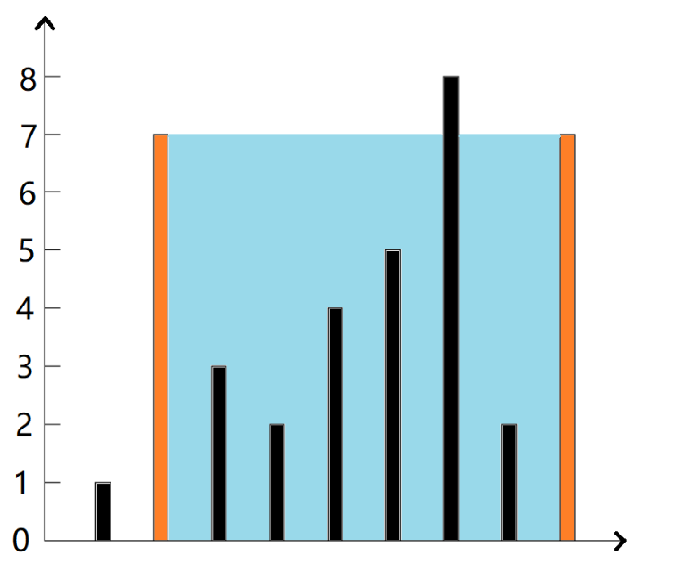

# Introduction

```
import os
print(f'hello')
```

## Dynamic Programm

## String

## Double Pointer

### BM93 盛水最多的容器

## 描述

给定一个数组height，长度为n，每个数代表坐标轴中的一个点的高度，height[i]是在第i点的高度，请问，从中选2个高度与x轴组成的容器最多能容纳多少水

1.你不能倾斜容器

2.当n小于2时，视为不能形成容器，请返回0

3.数据保证能容纳最多的水不会超过整形范围，即不会超过231-1

数据范围:

0<=height.length<=105  

0<=height[i]<=104

如输入的height为[1,7,3,2,4,5,8,2,7]，那么如下图:




# Diffcult_Company_Code_Problem

## Dynamic Programming


### Xiaomi

This is a variant of the **edit distance** problem, with an additional rule: if the **same type of operation** (e.g., consecutive insertions, consecutive deletions) is performed repeatedly, starting from the second operation, the cost of each subsequent operation is halved (rounded down).For example:

- The total cost of 3 consecutive insertions is 1+0+0=1

- The total cost of 2 consecutive substitutions is 1+0=1

### Huawei

### Meituan
